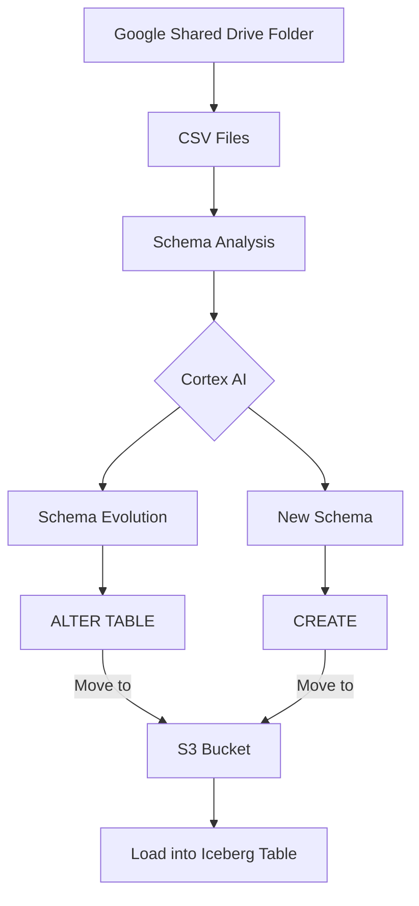

# 🎵 MusicFlow - Snowflake OpenFlow Demo

A comprehensive demonstration of Snowflake's OpenFlow platform showcasing intelligent data ingestion, schema evolution, and real-time analytics for music festival and concert data. This demo leverages Apache NiFi, Snowflake Cortex AI, and Apache Iceberg to create an end-to-end data pipeline that automatically detects schema changes and evolves data structures.

## 🎬 Demo Video

[](https://youtu.be/WnSY8XQ0oKk)

**Watch the demo in action**: [MusicFlow - Intelligent Data Pipelines for Music Festival Analytics](https://youtu.be/WnSY8XQ0oKk)

## 🌟 Overview

### The Problem We Solve

Building data pipelines for every new data source can be a real headache, taking up tons of time and money – sometimes even months! Even when the info is similar, different systems have totally different setups. This means what should be a quick job turns into months of intense, manual engineering.

### Our Solution

What if all that manual data wrangling just poof, disappeared? With Snowflake OpenFlow, we can whip up smart data pipelines that tap into Cortex to figure out schemas from any incoming data – messy or neat. And thanks to Snowflake OpenCatalog, schema changes are a breeze, instantly building unified Iceberg analytics tables.

MusicFlow demonstrates how to build intelligent data pipelines that can:

- **Automatically ingest** CSV files from various music festival sources (SoundWave Festival, Harmony Grove, Beat Valley, Music Mountain, Coastal Beats)
- **Intelligently detect** schema changes using Snowflake Cortex AI
- **Dynamically evolve** Iceberg table schemas without manual intervention
- **Provide real-time** schema registry monitoring and analytics
- **Support multiple** data sources with unified schema mapping

### Key Features

- 🤖 **AI-Powered Schema Intelligence**: Uses Snowflake Cortex to analyze CSV structure and determine schema evolution needs
- 🔄 **Dynamic Schema Evolution**: Automatically adds new columns when new data fields are detected
- 📊 **Real-time Monitoring**: Streamlit-based schema registry dashboard for pipeline visibility
- 🏗️ **External REST Catalog**: Integrates with Snowflake OpenCatalog for Iceberg table management
- 🎯 **Multi-Source Support**: Handles diverse festival data formats with semantic field mapping

## 🏗️ Architecture

### Data Flow



### Key Components

1. **Data Sources**: Festival CSV files (SoundWave Festival, Harmony Grove, Beat Valley, etc.)
2. **Ingestion Layer**: Snowflake OpenFlow with NiFi flows for file processing and routing
3. **AI Analysis**: Snowflake Cortex for intelligent schema detection
4. **Storage Layer**: Apache Iceberg tables via Snowflake OpenCatalog
5. **Monitoring**: Streamlit dashboard for pipeline visibility
6. **Schema Registry**: Metadata tracking and version management

## 🛠️ Prerequisites

### Required Tools & Software

| Tool | Version | Purpose | Installation |
|------|---------|---------|--------------|
| **Snowflake CLI** | Latest | Database operations and SPCS management | [Install Guide](https://docs.snowflake.com/en/user-guide/snowflake-cli.html) |
| **Polaris CLI** | Commit 52e30f0 | OpenCatalog management and operations | [Clone Repository](https://github.com/apache/polaris) |
| **Python** | 3.12+ | Application runtime | [Python Downloads](https://www.python.org/downloads/) |
| **jq** | Latest | JSON processing | `brew install jq` (macOS) or [Download](https://stedolan.github.io/jq/) |
| **Task** | Latest | Task runner | [Taskfile.dev](https://taskfile.dev/installation/) |

### Snowflake Requirements

> ⚠️ **IMPORTANT**: Snowflake Trials are **NOT supported** for this demo. You need a full Snowflake account with the following capabilities:

- **Snowflake Account** with Enterprise Edition (Production/Full Account Required)
- **Snowpark Container Services (SPCS)** enabled and configured
- **OpenFlow** enabled and accessible
- **Cortex AI** access for schema analysis
- **Snowflake OpenCatalog** enabled and configured for Iceberg tables

### Snowflake OpenCatalog Prerequisites

Before setting up the MusicFlow demo, you need to configure Snowflake OpenCatalog:

1. **OpenCatalog Account**: Create a Snowflake OpenCatalog account
2. **Catalog Configuration**: Set up a catalog with appropriate storage locations
3. **Service Connection**: Configure service connections and credentials
4. **Snowflake Integration**: Link OpenCatalog to your Snowflake account

### AWS Prerequisites

- **AWS CLI** configured with credentials
- **S3 Bucket** for data ingestion staging `your-music-flow-demo-ingest-data`.
- **AWS IAM User** with appropriate permissions for S3 to be used with Snowflake Openflow to move file to data ingestion bucket.
- **IAM Role** with appropriate permissions for S3 and OpenCatalog access

### Slack Prerequisites

- Slack channel for notifications  - Slack bot oauth token for notifications and a channel to send notifications to.

## 🚀 Quick Start

### 1. Environment Setup

```bash
# Clone the repository
git clone <repository-url>
cd music-flow

# Install Python dependencies using uv
uv sync

# Set up environment variables
cp env.template .env
# Edit .env with your Snowflake and AWS credentials
```

### 2. Snowflake Configuration

```bash
# Login to Snowflake
snow login

# Setup Snowflake environment (creates database, warehouse, role, and user)
task setup

# Verify environment setup
task env_check
```

### 3. Snowflake OpenCatalog Setup

> 💡 **Note**: It's recommended to perform OpenCatalog setup in a **new terminal session** to avoid conflicts with existing environment variables and ensure clean configuration.

#### Quick Setup (All Steps)

```bash
# Complete OpenCatalog setup with all dependencies
task opencatalog:setup USE_SNOWFLAKE_ROLE=your_admin_role

# Configure storage (S3 bucket and IAM roles)
task opencatalog:configure_storage USE_SNOWFLAKE_ROLE=your_admin_role

# Setup Snowflake integration
task opencatalog:setup_snowflake_integration USE_SNOWFLAKE_ROLE=your_admin_role
```

#### Individual Setup Steps

If you prefer to run setup steps individually:

```bash
# 1. Install Polaris CLI
task opencatalog:install_cli

# 2. Create catalog
task opencatalog:create_catalog

# 3. Create service principal and roles
task opencatalog:create_principal_roles_and_grants

# 4. Configure storage
task opencatalog:configure_storage USE_SNOWFLAKE_ROLE=your_admin_role

# 5. Setup Snowflake integration
task opencatalog:setup_snowflake_integration USE_SNOWFLAKE_ROLE=your_admin_role

# 6. Verify integration
task opencatalog:check_snowflake_integration USE_SNOWFLAKE_ROLE=your_admin_role
```

### 4. Snowflake Openflow Setup

**IMPORTANT**: Work in progress.

### 4. Demo Data Setup

```bash
# Set table parameters for the demo
export TABLE_NAMESPACE="events"
export TABLE_NAME="music_events"

# Create initial Iceberg table
task create_schema

# Download sample data sources
task download_sources
```

## 📊 Data Sources

The demo processes music festival data from multiple synthetic sources:

- **SoundWave Festival**: `soundwave_events_2025.csv`, `soundwave_events_enhanced.csv`
- **Harmony Grove**: `harmony_grove_lineup.csv`
- **Beat Valley**: `beat_valley_lineup_2025.csv`
- **Music Mountain**: `music_mountain_schedule.csv`
- **Coastal Beats**: `coastal_beats_performances.csv`

Each source has different field names and structures, demonstrating the schema evolution capabilities. All artist names, festival names, venue names, and sponsor brands are completely synthetic to avoid any trademark or copyright issues.

## 🔧 Available Tasks

### Core Environment Tasks

```bash
# Environment management
task setup                    # Setup Snowflake environment (database, warehouse, role, user)
task clean                    # Clean environment for fresh start
task env_check               # Check if environment variables are properly set

# Schema operations
task create_schema           # Create new Iceberg table with generated SQL
task evolve_schema           # Evolve existing table schema
task download_sources        # Download generated SQL files from Snowflake stage

# Data operations
task spark_sql               # Run Spark SQL queries against Iceberg tables
task truncate_schema_registry # Truncate the schema registry table
task truncate_music_flow_resources # Clean up music flow resources
```

### OpenCatalog Tasks

```bash
# OpenCatalog setup
task opencatalog:setup                    # Complete OpenCatalog setup (all steps)
task opencatalog:install_cli             # Install Polaris CLI for OpenCatalog management
task opencatalog:create_catalog          # Create music flow demo catalog in OpenCatalog
task opencatalog:create_principal_roles_and_grants # Create service principal and roles
task opencatalog:configure_storage       # Configure OpenCatalog storage (S3 bucket and IAM)
task opencatalog:setup_snowflake_integration # Setup Snowflake OpenCatalog integration
task opencatalog:check_snowflake_integration # Check Snowflake integration status

# OpenCatalog utilities
task opencatalog:catalog_info            # Get catalog information
task opencatalog:env_check              # Check OpenCatalog environment variables

# OpenCatalog cleanup
task opencatalog:cleanup                 # Complete OpenCatalog cleanup (all steps)
task opencatalog:cleanup_resources       # Clean up OpenCatalog resources
task opencatalog:cleanup_snowflake_integration # Clean up Snowflake catalog integration
```

### Usage Examples

```bash
# Basic setup workflow
task setup
task opencatalog:setup USE_SNOWFLAKE_ROLE=your_admin_role
task opencatalog:configure_storage USE_SNOWFLAKE_ROLE=your_admin_role
task opencatalog:setup_snowflake_integration USE_SNOWFLAKE_ROLE=your_admin_role

# Demo workflow
export TABLE_NAMESPACE="events"
export TABLE_NAME="music_events"
task create_schema
task evolve_schema

# Cleanup workflow
task clean
task opencatalog:cleanup
```

#### 🤖 **AI-Powered Solution in Action**

#### Step 1: Schema Detection & Mapping

- AI analyzes incoming CSV structure
- Maps different field names semantically:
  - `artist_name` ↔ `dj_performer` ↔ `performer` → **unified_artist**
  - `main_stage` ↔ `venue_section` ↔ `location` → **unified_stage**
  - `vip_price` ↔ `ticket_cost` → **unified_price**

#### Step 2: Schema Evolution

- Detects new fields (`genre`, `sponsor`)
- Automatically evolves Iceberg table schema
- Adds new columns without breaking existing data

#### Step 3: Unified Analytics Table

```sql
CREATE ICEBERG TABLE "events"."music_events" (
    "event_id" BIGINT NOT NULL,
    "artist_name" STRING,           -- Unified from artist_name/dj_performer
    "main_stage" STRING,            -- Unified from main_stage/venue_section  
    "start_time" STRING,            -- Unified from start_time/performance_time
    "vip_price" DOUBLE,             -- Unified from vip_price/ticket_cost
    "genre" STRING,                 -- New field from evolution
    "sponsor" STRING                -- New field from evolution
);
```

#### 🎯 **The Result: One Unified Table, Any Data Format**

- **Works for retail, logistics, finance, healthcare, any industry**
- **Minutes of smart automation** instead of months of manual work
- **Scales easily** from three data sources to three thousand

### 🚀 **Live Demo Commands**

- Copy file e.g. `soundwave_events_2025.csv` to Google Shared Drive folder
- Wait for the pipeline to process the file, generate SQL DDL files and move the file to the data ingestion bucket.
- Run the `create_schema` task to create the table or `evolve_schema` task to evolve the schema.
- Watch the rows form CSV loaded into Iceberg table

> **NOTE**: Each milestone in pipeline will have notifications sent to Slack channel.

## 🎯 Usage Examples

### Creating a New Table

```bash
# Set table parameters
export TABLE_NAMESPACE="events"
export TABLE_NAME="music_events"

# Create table with generated SQL
task create_schema
```

### Evolving Schema

```bash
# When new fields are detected, evolve the schema
task evolve_schema
```

### Cleanup

```bash
# Clean up OpenCatalog resources
task opencatalog:cleanup

# Clean up all MusicFlow resources
task clean
```

### Complete Demo Workflow

```bash
# 1. Initial setup
task setup
task opencatalog:setup USE_SNOWFLAKE_ROLE=your_admin_role
task opencatalog:configure_storage USE_SNOWFLAKE_ROLE=your_admin_role
task opencatalog:setup_snowflake_integration USE_SNOWFLAKE_ROLE=your_admin_role

# 2. Demo data setup
export TABLE_NAMESPACE="events"
export TABLE_NAME="music_events"
task create_schema

# 3. Upload data and evolve schema
# (Upload CSV files to S3 with appropriate tags)
task evolve_schema

# 4. Cleanup when done
task clean
task opencatalog:cleanup
```

## 🔍 Troubleshooting

### Common Issues

1. **Schema Analysis Failures**: Ensure Cortex AI is enabled and accessible
2. **Iceberg Table Creation**: Verify OpenCatalog configuration and permissions
3. **OpenFlow Service Errors**: Check SPCS service status and runtime extensions
4. **Permission Issues**: Verify service account has appropriate roles
5. **Trial Account Limitations**: Ensure you're using a full Snowflake account, not a trial
6. **OpenCatalog Connection Issues**: Verify OC_ environment variables and service credentials
7. **Storage Access Issues**: Check AWS IAM role permissions and external ID configuration

### Debug Commands

```bash
# Check environment setup
task env_check
task opencatalog:env_check

# View schema registry
snow sql --query "SELECT * FROM metadata.schema_registry"

# Check OpenFlow service status
snow spcs service list --database your_demo_database

# View service logs
snow spcs service logs --service-name your_service_name

# Test OpenCatalog connection
task opencatalog:catalog_info

# Verify catalog integration in Snowflake
task opencatalog:check_snowflake_integration USE_SNOWFLAKE_ROLE=your_admin_role

# Check Snowflake integration status
snow sql --query "SHOW CATALOG INTEGRATIONS"

# Test Iceberg table creation
snow sql --query "CREATE ICEBERG TABLE IF NOT EXISTS test_table (id INT) IN CATALOG music_flow_catalog"
```

## 🏗️ Technology Stack

**Intelligent Data Pipelines. Instant Analytics.**

| Technology | Purpose | Integration |
|------------|---------|-------------|
| **Snowflake** | Data Platform & Analytics | Core platform |
| **Snowflake OpenFlow** | Data Pipeline Orchestration | Apache NiFi-based flows |
| **Cortex AI** | Schema Intelligence | AI-powered analysis |
| **Snowflake OpenCatalog(Managed Apache Polaris)** | Open Catalog | Iceberg table management |
| **Apache Iceberg** | Data Lakehouse Format | Unified table format |

## 📚 Additional Resources

- [Snowflake OpenFlow Documentation]<https://docs.snowflake.com/en/user-guide/data-integration/openflow/about>)
- [Apache NiFi Documentation](https://nifi.apache.org/docs/)
- [Apache Iceberg Documentation](https://iceberg.apache.org/)
- [Snowflake Cortex AI](https://docs.snowflake.com/en/guides-overview-ai-features)
- [Snowflake OpenCatalog](https://docs.snowflake.com/en/user-guide/opencatalog/tutorials/open-catalog-gs)
- [Catalog Linked Database](https://docs.snowflake.com/en/user-guide/tables-iceberg-catalog-linked-database)

## 🤝 Contributing

1. Fork the repository
2. Create a feature branch
3. Make your changes
4. Test thoroughly
5. Submit a pull request

## 📄 License

This project is licensed under the Apache License - see the LICENSE file for details.

---

## 🎵 MusicFlow - Intelligent Data Pipelines for Music Festival Analytics

### "Minutes of smart automation instead of months of manual work"
